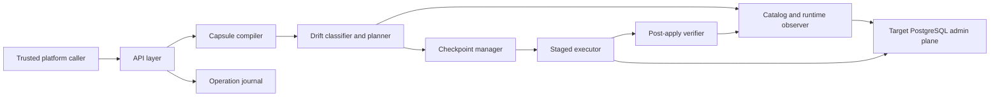

# Autonomous Capsule Reconciler (ACR) Specification v0.1

Status: Phase 0 baseline

## Purpose

ACR is the mechanism that manages one PostgreSQL tenant as a bounded, auditable, reversible unit called a `Database Capsule`.

This spec freezes:
- the capsule boundary
- the desired and observed state model
- the fingerprint model
- the reconciliation pipeline
- rollback and idempotency semantics

## Architecture Overview

## Scope

In scope:
- database creation and ownership
- role creation and managed role settings
- grants on managed schemas and objects
- connection/session limits
- backup class and SLO class assignment
- drift detection and classification
- staged reconciliation with verification
- reversible checkpoints for autonomous mutations
- operation journaling and fingerprint generation

Out of scope:
- generic secret-management features
- non-PostgreSQL engines
- destructive autonomous deletion of non-empty tenants
- arbitrary client-supplied SQL

## Core Terms

`Database Capsule`
: the smallest autonomous management boundary, keyed by `app + environment`

`Desired state`
: the canonical policy definition for the capsule

`Observed state`
: the canonical projection of PostgreSQL catalog, runtime, and control-plane facts needed for reconciliation

`Invariant`
: a condition that must hold before and after reconciliation

`Fingerprint`
: a deterministic hash of canonicalized desired state, observed state, a plan artifact, or a checkpoint package

## Capsule Model

Each capsule has:
- `capsule_id`
- `app`
- `environment`
- `revision_number`

Desired state sections:
- identity and ownership metadata
- database definition
- managed roles
- privilege policy
- protection classes
- safety policy

Observed state sections:
- database existence and owner
- role existence and managed role attributes
- grants and default privileges in managed schemas
- session and lock telemetry relevant to planned mutations
- last known desired, observed, and plan fingerprints

## Invariants

Identity invariants:
- one capsule maps to exactly one `app/environment`
- ACR never mutates resources outside capsule scope

Safety invariants:
- no autonomous mutation begins if preflight checks fail
- no non-reversible mutation runs in autonomous mode
- verification failure forces rollback or manual hold

Determinism invariants:
- identical desired input yields identical desired fingerprint
- identical desired and observed inputs yield identical plan ordering
- replay of the same idempotent request yields no duplicate side effects

Audit invariants:
- every write action emits journal records
- rollback outcome is recorded if rollback occurs

## Fingerprints

ACR uses domain-separated SHA-256 over canonical JSON.

Canonicalization rules:
1. object keys sorted lexicographically
2. unordered sets sorted deterministically
3. defaults made explicit
4. out-of-scope values excluded
5. secret values excluded and replaced with stable references
6. run-unique fields such as timestamps and request IDs excluded
7. privilege lists sorted and deduplicated

Fingerprint domains:
- `acr:desired:v1`
- `acr:observed:v1`
- `acr:plan:v1`
- `acr:checkpoint:v1`

Fingerprint types:
- `desired_fingerprint`
- `observed_fingerprint`
- `plan_fingerprint`
- `checkpoint_fingerprint`

## Drift Model

`safe`
: correctable autonomously with reversible mutations

`warning`
: correctable but requires elevated scrutiny, usually because runtime conditions increase risk

`critical`
: must not be corrected autonomously

Examples:
- missing managed grant is `safe`
- owner mismatch with active sessions is `warning`
- unmanaged conflicting ownership inside managed scope is `critical`

## Reconciliation Pipeline

1. Intake
- validate auth, capsule identity, idempotency key

2. Compile
- normalize desired state
- derive desired fingerprint
- resolve management boundary

3. Observe
- capture catalog, runtime, and control-plane facts
- derive observed fingerprint

4. Classify
- compare desired and observed state
- assign drift items and severity

5. Plan
- generate deterministic ordered mutation and verification stages
- reject any out-of-scope mutation
- derive plan fingerprint

6. Checkpoint
- persist reversible pre-change state before mutation

7. Preflight
- enforce session, lock, and ownership safety guards

8. Apply
- execute deterministic staged mutations

9. Verify
- re-observe and re-check invariants

10. Finalize
- mark converged on success
- otherwise roll back or hold for manual intervention

## Rollback

Rollback is mandatory for autonomous reversible mutation classes.

Checkpoint package contents:
- capsule identity and revision
- plan fingerprint
- prior owners
- prior managed role settings
- prior grants and default privileges
- existence flags for newly created resources

Rollback triggers:
- stage failure after mutation starts
- verification failure
- runtime condition becomes unsafe during apply

If rollback fails, the capsule enters `ManualIntervention`.

## Deterministic Idempotency

Operation identity:
- caller scope
- capsule identity
- operation kind
- client `Idempotency-Key`

Request discipline:
- same key + same normalized request hash returns the original operation
- same key + different request hash is rejected
- in-flight duplicate returns current operation state

## Phase 1 Design Implications

Phase 1 needs these persistence concepts:
- `capsule`
- `capsule_revision`
- `operation`
- `reconciliation_run`
- `checkpoint`
- `audit_event`

## Open Review Questions

- Should backup and SLO classes be direct policy fields or external references?
- What is the minimum runtime telemetry needed for session-aware safety?
- Which create-time mutations remain safe to auto-rollback before client use?
