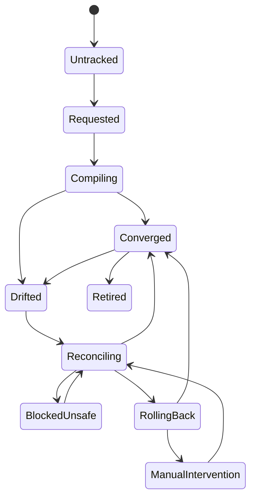
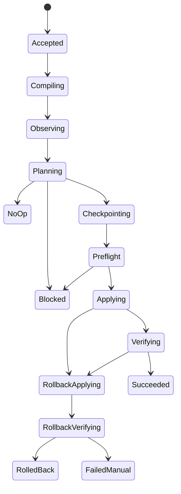

# ACR State Machine v0.1

Status: Phase 0 baseline

## Capsule Lifecycle

States:
- `Untracked`
- `Requested`
- `Compiling`
- `Converged`
- `Drifted`
- `Reconciling`
- `BlockedUnsafe`
- `RollingBack`
- `ManualIntervention`
- `Retired`

Key distinction:
- `BlockedUnsafe` means mutation was stopped before unsafe change
- `ManualIntervention` means mutation already happened and autonomous recovery was insufficient

## Reconciliation Run Lifecycle

Run states:
- `Accepted`
- `Compiling`
- `Observing`
- `Planning`
- `NoOp`
- `Blocked`
- `Checkpointing`
- `Preflight`
- `Applying`
- `Verifying`
- `Succeeded`
- `RollbackApplying`
- `RollbackVerifying`
- `RolledBack`
- `FailedManual`

## Mandatory Guards

- no plan may include out-of-scope mutation
- no apply stage may start before checkpoint and preflight complete
- success is published only after post-apply verification
- rollback success requires verified restoration of safe state

## Operational Metrics

- time from `Drifted` to `Converged`
- percent of runs ending in `Succeeded`
- percent of runs ending in `RolledBack`
- `BlockedUnsafe` count by reason code
- `ManualIntervention` count by failure stage
