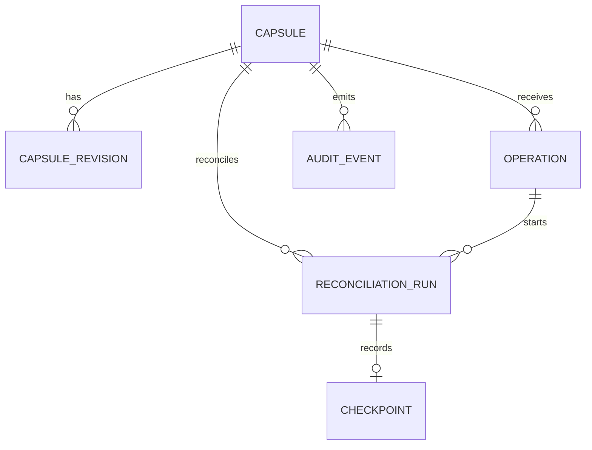

# Control-Plane Schema v0.1

Status: Phase 0 baseline

## Entity Overview

## Tables

`capsule`
- durable identity and current status

`capsule_revision`
- immutable desired-state history

`operation`
- idempotent write request journal and client-facing status

`reconciliation_run`
- bounded execution record for one attempt

`checkpoint`
- reversible pre-change state for one run

`audit_event`
- append-only tamper-evident event stream

## Core Constraints

- unique `(app, environment)` on `capsule`
- unique `(capsule_id, revision_number)` on `capsule_revision`
- unique `(capsule_id, desired_fingerprint)` on `capsule_revision`
- unique `(caller_principal, capsule_id, operation_kind, idempotency_key)` on `operation`
- one `checkpoint` per `reconciliation_run`

## Notes

- enum-like fields may start as `text` plus check constraints
- `jsonb` is used for immutable specs, checkpoints, and audit payloads
- per-capsule serialization may be enforced with queue leasing or advisory locking in implementation
