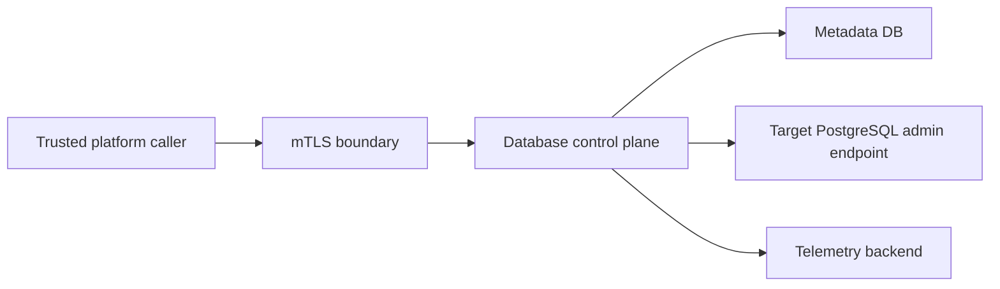

# Threat Model v0.1

Status: Accepted

## Assets

- control-plane metadata store
- PostgreSQL admin credentials
- service identity certificates and keys
- audit ledger integrity
- capsule specifications
- reconciliation checkpoints

## Trust Boundaries

## Top Threats and Controls

Unauthorized capsule mutation:
- mTLS
- signed service tokens
- scoped authorization
- immutable journal

Scope escape into unmanaged resources:
- compiled management boundary
- plan rejection on out-of-scope mutation

Unsafe autonomous change during active workload:
- session-aware preflight checks
- warning and critical drift classes
- rollback and manual-intervention states

Audit tampering:
- append-only audit events
- hash chaining
- integrity verification

Credential disclosure:
- redaction
- secret injection
- least-privilege roles

Replay or duplicate mutation:
- idempotency keys
- normalized request hash
- per-caller plus per-capsule uniqueness
